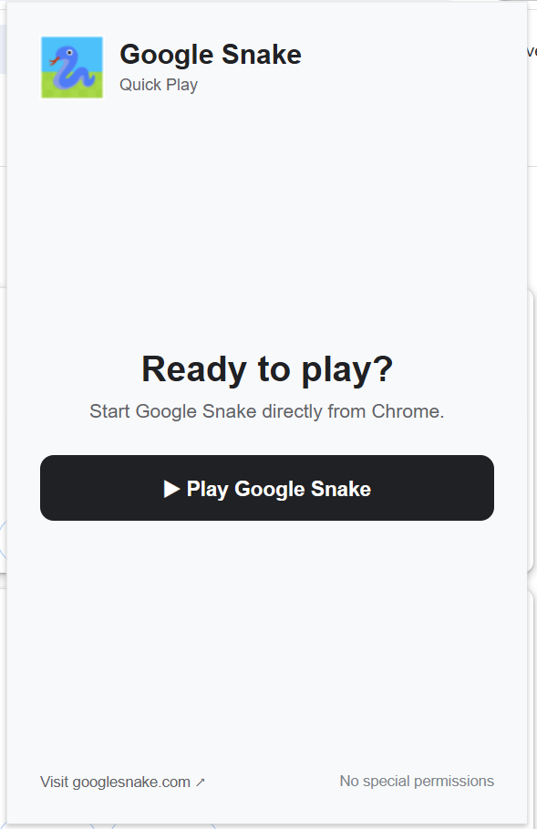
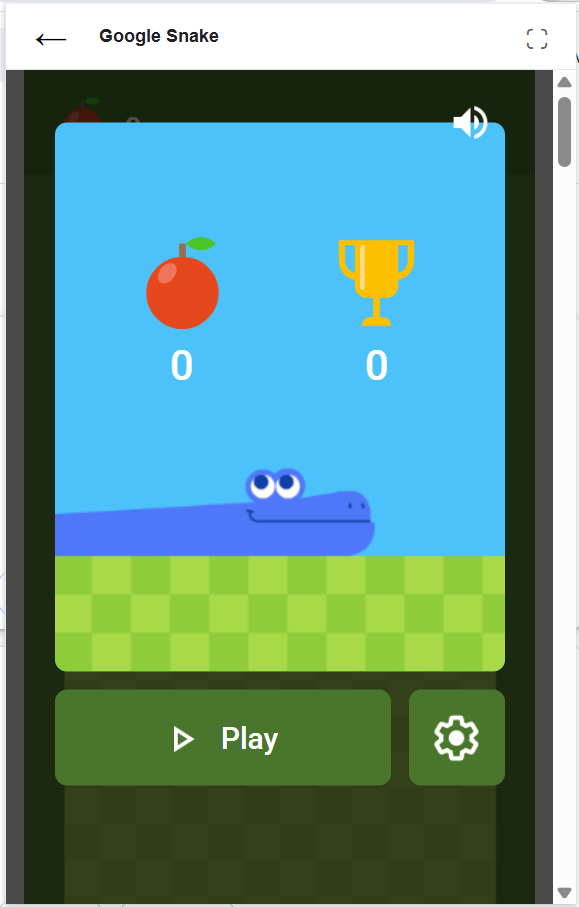

# Google Snake - Quick Play 🐍

A lightweight Chrome extension that gives you quick access to Google Snake directly from your browser.

[🎮 Play Google Snake online](https://www.googlesnake.com/)

## Features

- 🐍 One-click access to Google Snake
- ▶️ Play directly inside the extension popup
- ⛶ Open the game in a larger browser view
- ⚡ Lightweight Manifest V3 extension
- 🔒 No special browser permissions

## Screenshots

### Extension popup



### Google Snake game



## Installation for development

1. Download or clone this repository.
2. Open Chrome and go to `chrome://extensions`.
3. Enable **Developer mode**.
4. Click **Load unpacked**.
5. Select the `extension` folder.

## Project structure

```text
google-snake-extension/
├── extension/
│   ├── manifest.json
│   ├── popup.html
│   ├── popup.css
│   ├── popup.js
│   └── icons/
├── screenshots/
├── LICENSE
└── README.md
```

## Website

The extension provides quick access to:

https://www.googlesnake.com/

## Contributing

Suggestions, bug reports, and improvements are welcome.

## License

MIT
